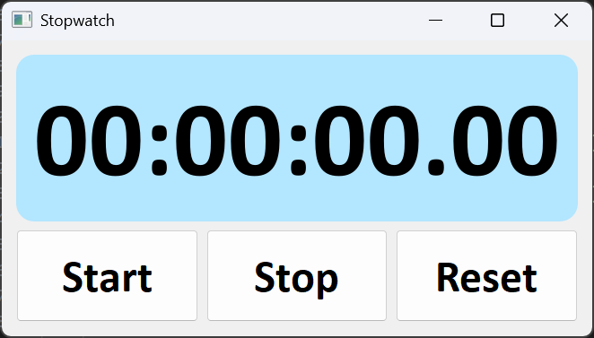

# Stopwatch Project ⏱️

Aplikasi stopwatch sederhana berbasis GUI menggunakan **Python** dan **PyQt5**. Proyek ini cocok untuk latihan pemrograman Python dan pengembangan antarmuka desktop.

## 🖼️ Preview

<div align="center">
  
</div>

Stopwatch menampilkan waktu dalam format **jam:menit:detik.milidetik** dan memiliki tiga tombol:
- **Start**: Memulai stopwatch
- **Stop**: Menghentikan stopwatch
- **Reset**: Mengatur ulang waktu ke nol

## 🛠️ Teknologi yang Digunakan

- Python 3
- PyQt5

## ⚙️ Cara Menjalankan

1. **Clone repositori ini:**

   ```bash
   git clone https://github.com/Bama2262/Stopwatch-Project.git
   cd Stopwatch-Project

2. **Pastikan PyQt5 sudah terinstal (jika belum):**
   ```bash
   pip install PyQt5

3. **Jalankan aplikasi:**
   ```bash
   python main.py

## 📌 Catatan
- Aplikasi ini menggunakan **QTimer** untuk menghitung waktu dan **QTime** sebagai penyimpan waktu saat ini.
- Tampilan dibuat dengan **QVBoxLayout** dan **QHBoxLayout**, serta diberi gaya menggunakan **setStyleSheet**.